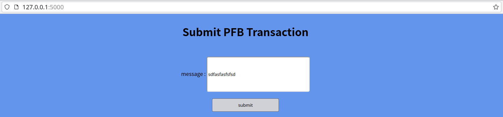

# celestia_pfb_submit 

Submit pfb transactions to celestia.




## Please run a celestia light node with port 26659 at first.

## How to run

1) install the required dependencies: 

    ```
    pip install Flask==2.2.3
    pip install requests==2.28.2
    ```

2) Run script: `python main.py `

3) Go to http://127.0.0.1:5000 and submit pfb transaction.
